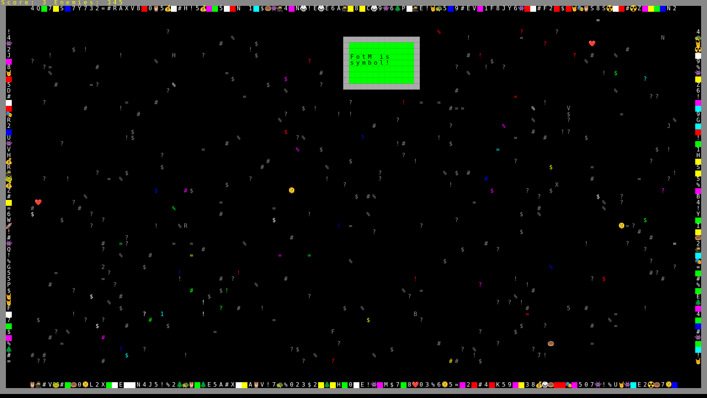
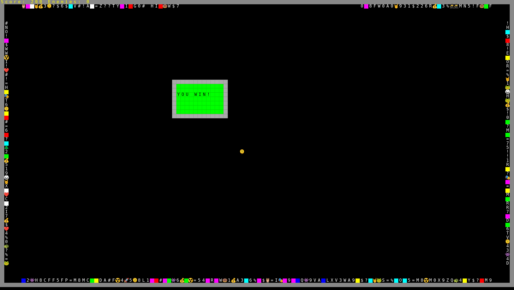
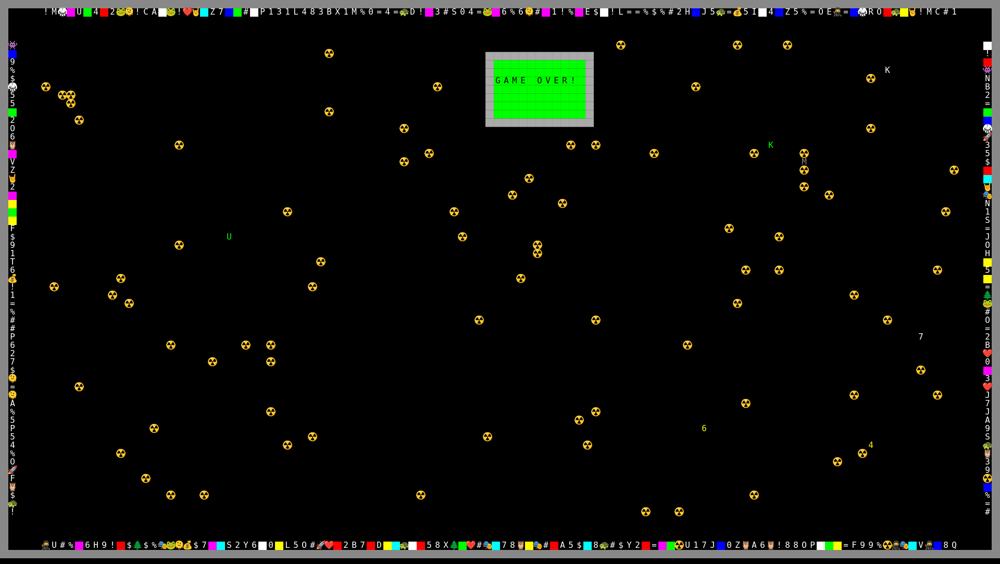

# Flavor of the Month

*Follow the TV-induced flavor of the month or perish*

GGJ2026 Theme "Mask". Covered [diversifiers](https://globalgamejam.org/global-game-jam-2026-diversifiers-have-arrived):

* Cartridge Ready (Your game should be under 10 MB.)
* Random encounter (Make the game around procedural generation.)

## Manual

* Your start character/mask is the white `@`.
* Move around with WASD or arrow keys.
* Pickup one of the masks from the sides to follow the fashion dictated by the TV screen.
* You lose HP, if you don't follow current fashion. If your HP reaches `0`, you lose.
* Same applies to your contestants. You win, if you are the last to remain.

* If you want a faster/easier game, reduce the window size and reload.

## Screenshots

## Credits

* Oliver "oz" Z.
* `gemini-cli`

Uses [rot.js](https://github.com/ondras/rot.js) by Ondrej Zara. Some code stolen&adapted from [BotMos](https://botmos.org/).